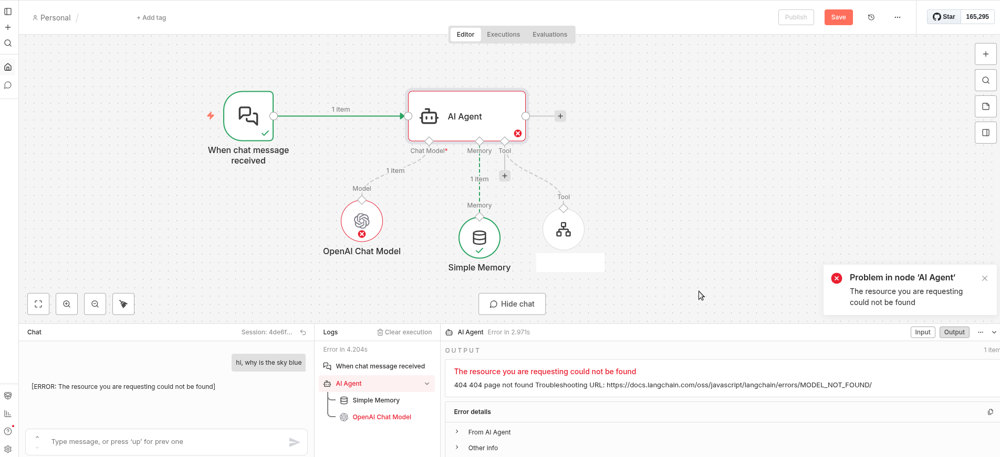
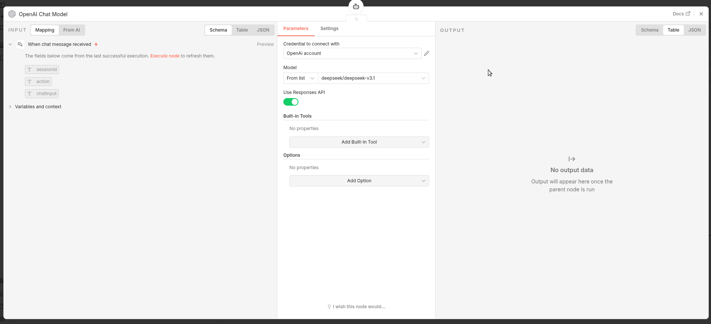
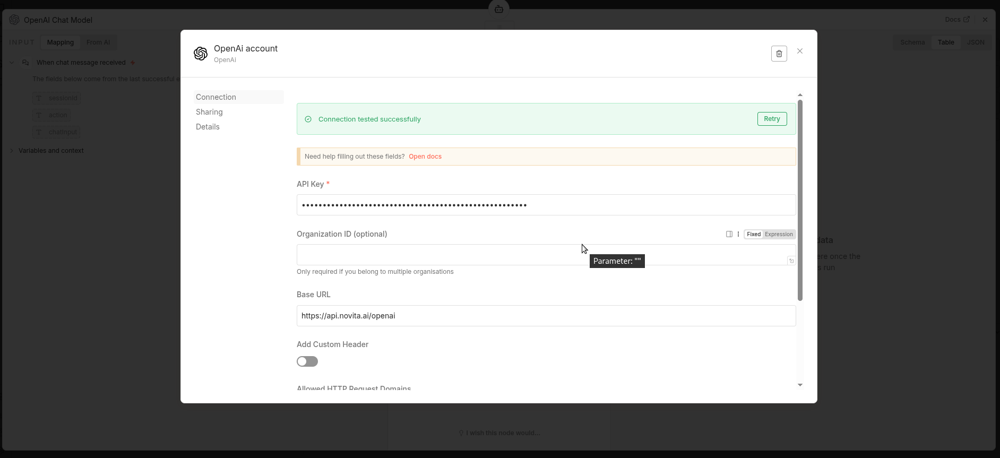
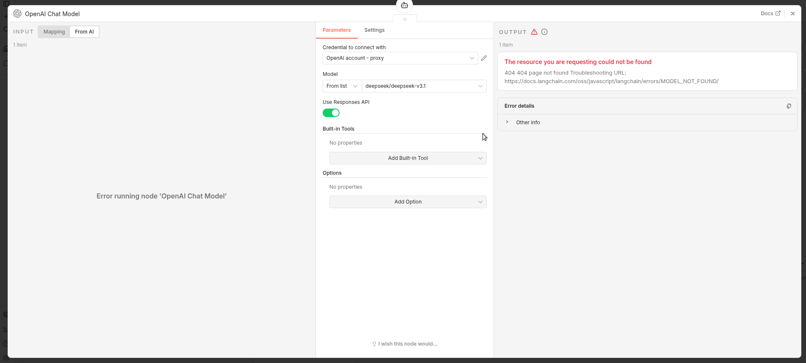
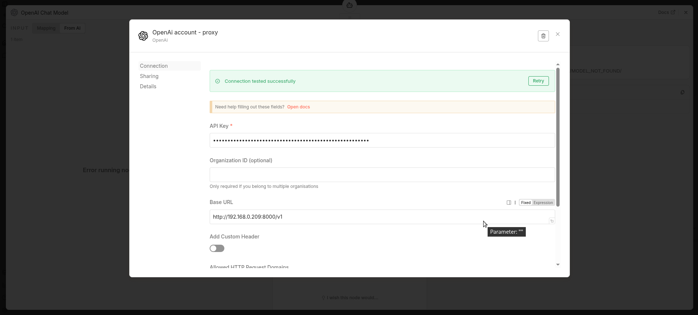
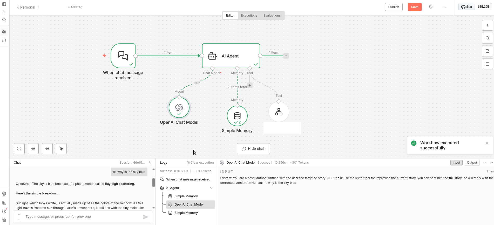
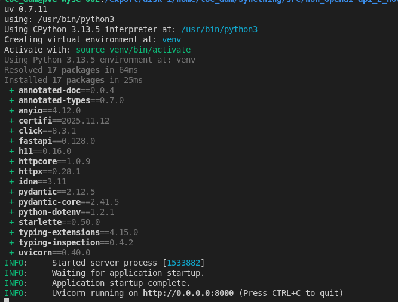

- [n8n\_openai-api\_2\_novita.ai-api\_proxy](#n8n_openai-api_2_novitaai-api_proxy)
- [Problem i encountered using the openai-api node in n8n](#problem-i-encountered-using-the-openai-api-node-in-n8n)
  - [n8n overview](#n8n-overview)
  - [n8n used config which did not work](#n8n-used-config-which-did-not-work)
  - [n8n proxy config which did work](#n8n-proxy-config-which-did-work)
  - [n8n working with novita.ai over proxy](#n8n-working-with-novitaai-over-proxy)
- [This Solution](#this-solution)
  - [pre-requisits](#pre-requisits)
  - [installation](#installation)
  - [config](#config)
  - [running](#running)


# n8n_openai-api_2_novita.ai-api_proxy
Enabling novita.ai as LLM provider for n8n in the AI Agent Node.
Maybe this gets fixed natively somewhen, at the time of writing this was not.

# Problem i encountered using the openai-api node in n8n

## n8n overview


## n8n used config which did not work



## n8n proxy config which did work



## n8n working with novita.ai over proxy


# This Solution
Provides an API-mediation layer which translates the openapi requests into the novita.ai api (openai), available ones.
(tested at this moment of writting)

## pre-requisits
* uv installed

## installation
Just clone the repo to your local directory

## config
Update the .env file with your target upstream api url and your api-key

```
NOVITA_API_KEY="<here goes your key>"
UPSTREAM_BASE_URL=https://api.novita.ai/v3/openai
```

## running
```
./runit.sh
```
looks like:


